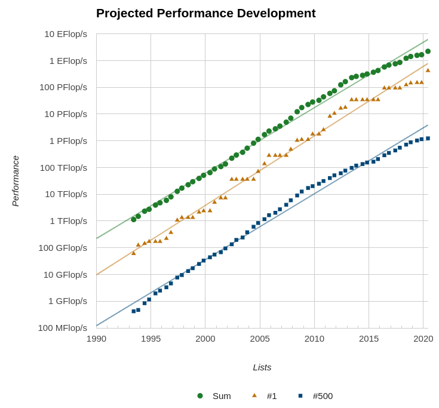
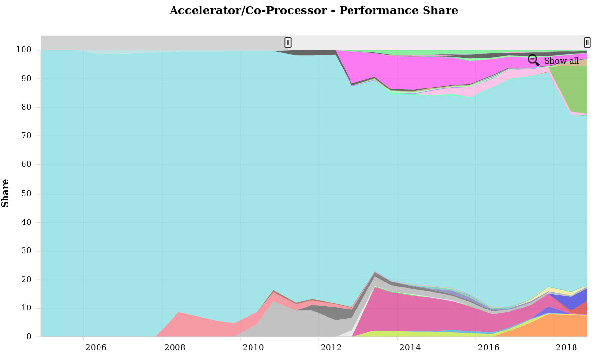
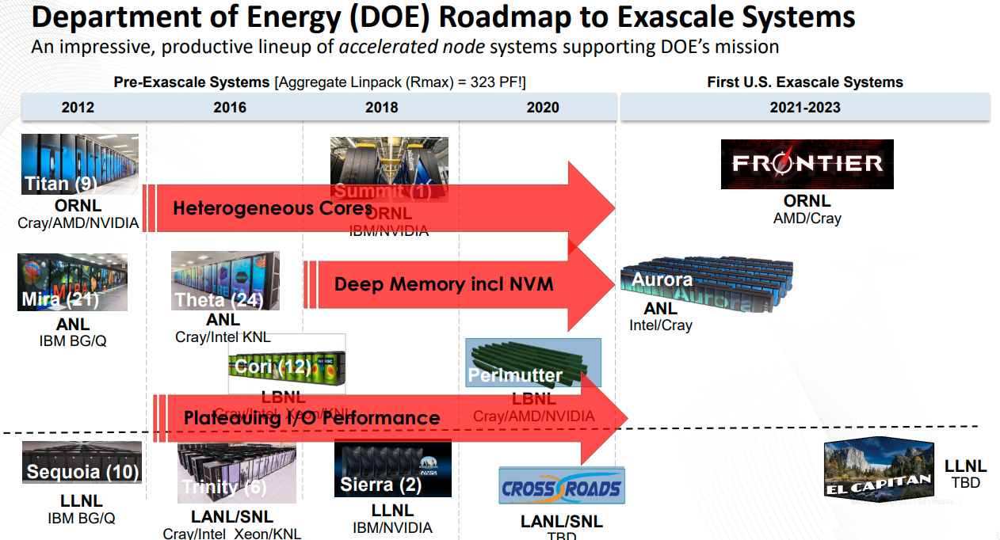
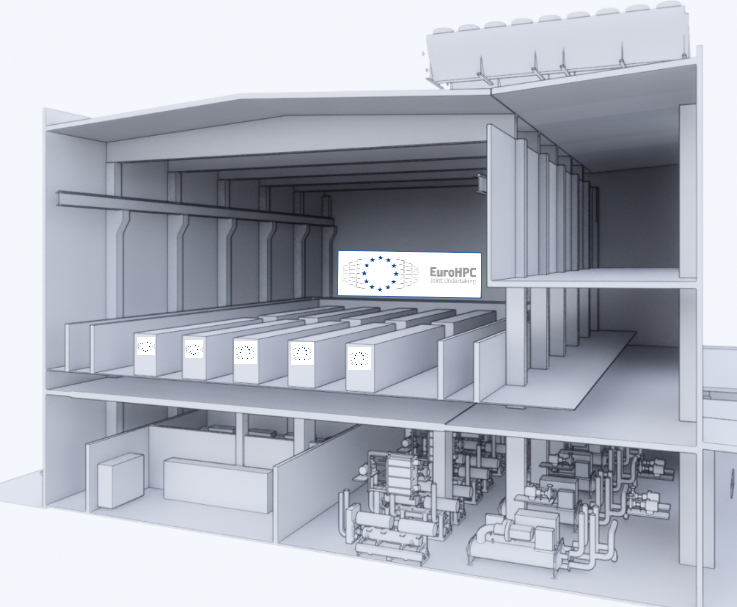
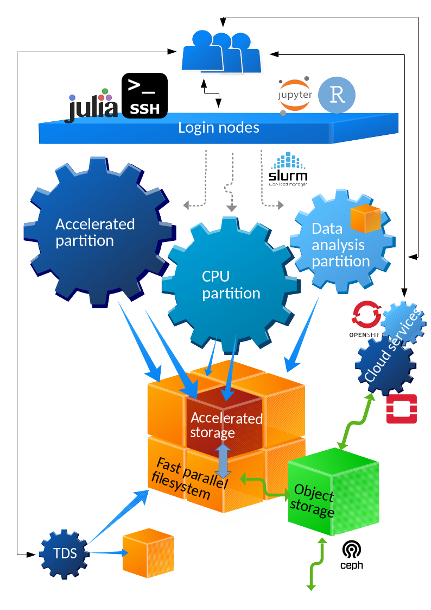
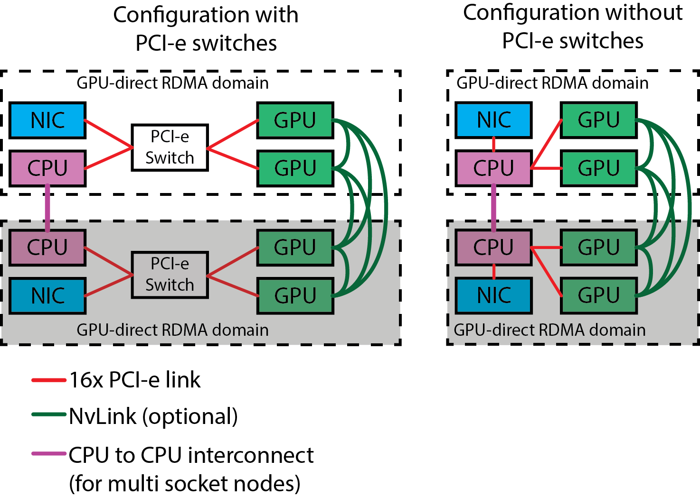
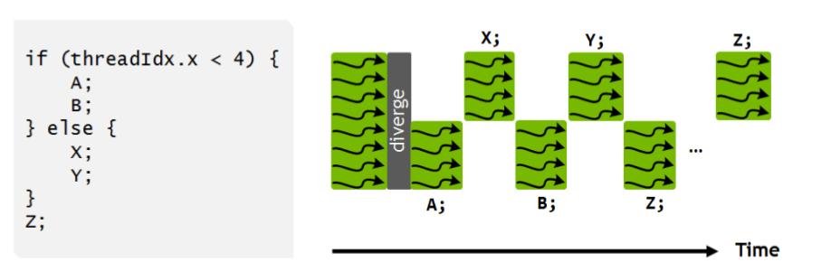

# High-performance computing

- High performance computing is fueled by ever increasing performance
- Increasing performance allows breakthroughs in many major challenges that
  humankind faces today
- Not only hardware performance, algorithmic improvements have also added
  ordered of magnitude of real performance

# HPC through the ages

- Achieving performance has been based on various strategies throughout the
  years
    - Frequency, vectorization, multinode, multicore ...
    - Now performance is mostly limited by power consumption
- Accelerators provide compute resources based on a very high level of
  parallelism to reach high performance at low relative power consumption

# Accelerators

- Specialized parallel hardware for floating point operations
    - Co-processors for traditional CPUs
    - Based on highly parallel architectures
    - Graphics processing units (GPU) have been the most common
      accelerators during the last few years
- Promises
    - Very high performance per node
- Usually major rewrites of programs required

# Accelerator performance growth

{.center}

# Accelerators share of 500 fastest systems (Top500)

{.center width=75%}

# US roadmap to Exascale

{.center width=75%}

# EU roadmap to Exascale

{.center width=75%}

# Lumi - Pre-exascale system in Finland

{}

{width=65%}

# Accelerator model today

- Connected to CPUs via PCIe
- Local memory
    - Smaller than main memory (32 GB in Puhti)
    - Very high bandwidth (up to 900 GB/s)
    - Latency high compared to compute performance
- Data must be copied over the PCIe bus

{}
{width=100%}

# GPU architecture

- Designed for running tens of thousands of threads simultaneously on
  thousands of cores
- Very small penalty for switching threads
- Running large amounts of threads hides memory access penalties
- Very expensive to synchronize all threads
- Now Nvidia GPUs have close to monopoly in HPC - will change in next few years

# GPU architecture: Nvidia Volta

- 80 streaming multi processor units (SM), each comprising many smaller Cuda
  cores
    - 5120 single precision cores
    - 2560 double precision cores
    - 640 tensor cores
- Common L2 cache (6144 KB) for all multi processors
- HBM2 memory, typically 16 GB or 32 GB

{ width=100% }

# GPU architecture: Nvidia Volta

{ .center width=77% }

# GPU architecture: Nvidia Volta SM

- 64 single precision cores
- 32 double precision cores
- 64 integer cores
- 8 Tensore cores
- 128 KB memory block for L1 and shared memory
    - 0 - 96 KB can be set to user managed shared memory
    - The rest is L1
- 65536 registers - enables the GPU to run a very large number of threads

{ .center width=70% }

# GPU architecture: warps
- All execution is done in terms of 32 threads, a warp
- In a warp 32 threads compute the same instruction on different data
  (SIMT)
    - Warps are further collected into thread blocks; each executed on one SM
    - In case of divergence (if...) computation is done one branch at a time

{ .center width=60% }

# Challenges in using Accelerators

**Applicability**: Is your algorithm suitable for GPU?

**Programmability**: Is the programming effort acceptable?

**Portability**: Rapidly evolving ecosystem and incompatibilities between vendors.

**Availability**: Can you access a (large scale) system with GPUs?

**Scalability**: Can you scale the GPU software efficiently to several nodes?

# Using GPUs

1. Use existing GPU applications
2. Use accelerated libraries
3. Directive based methods
    - OpenMP
    - **OpenACC**
4. Use lower level language
    - CUDA
    - HIP
    - OpenCL

Easier, but more limited

{ width=15% }

More difficult, but more opportunities

# Directive-based accelerator languages

- Annotating code to pinpoint accelerator-offloadable regions
- OpenACC standard created in Nov 2011
    - Focus on optimizing productivity (reasonably good performance with
      minimal effort)
    - Current standard is 3.0 (November 2019)
    - Mostly Nvidia only
- OpenMP
    - Earlier only threading for CPUs
    - 4.5 also includes for the first time some support for accelerators
    - 5.0 standard vastly improved
    - Dominant directive approach in the future?

# GPUs at CSC - Puhti-AI

- In total 80 nodes with a total peak performance of 2.7 Petaflops
- Each node has
    - Two latest generation Intel Xeon processors, code name Cascade Lake,
      with 20 cores each running at 2.1 GHz (Xeon Gold 6230)
    - Four Nvidia Volta V100 GPUs with 32 GB of memory each
    - 384 GB of main memory
    - 3.2 TB of fast local storage
    - Dual rail HDR100 interconnect network connectivity providing 200Gbps
      aggregate bandwidth

# Parallel computing concepts {.section}

# Computing in parallel

- Serial computing
    - Single processing unit ("core") is used for solving a problem

{.center width=105%}

# Computing in parallel

- Parallel computing
    - A problem is split into smaller subtasks
    - Multiple subtasks are processed *simultaneously* using multiple
      cores
{.center width=120%}

# Exposing parallelism

- Data parallelism
    - Data is distributed to processor cores
    - Each core performs simultaneously (nearly) identical operations with
      different data
    - Especially good on GPUs(!)
- Task parallelism
    - Different cores perform different operations with (the same or)
      different data
- These can be combined

{ }

# Parallel scaling

- Strong parallel scaling
    - Constant problem size
    - Execution time decreases in proportion to the increase in the number
      of cores
- Weak parallel scaling
    - Increasing problem size
    - Execution time remains constant when number of cores increases in
      proportion to the problem size

{ }

# Amdahl's law

- Parallel programs often contain sequential parts
- *Amdahl's law* gives the maximum speed-up in the presence of
   non-parallelizable parts
- Main reason for limited scaling
-  Maximum speed-up is
<small>
$$
S=\frac{1}{ ( 1-F) + F/N}
$$
</small>

where $F$ is the parallel fraction and $N$ is the number of cores

{ }

# Parallel computing concepts

- Load balance
    - Distribution of workload to different cores
- Parallel overhead
    - Additional operations which are not present in serial calculation
    - Synchronization, redundant computations, communications

# Summary

- HPC throughout the ages -- performance through parellelism
- Programming GPUs
    - CUDA, HIP
    - Directive based methods
