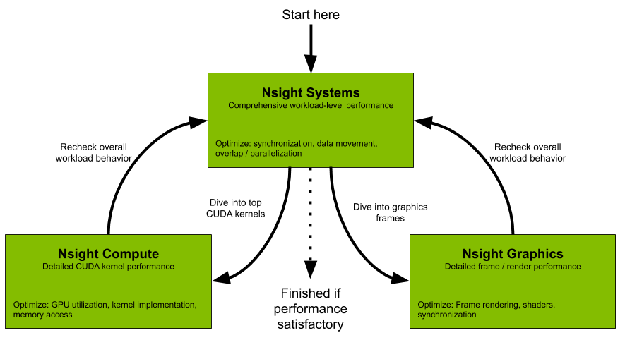
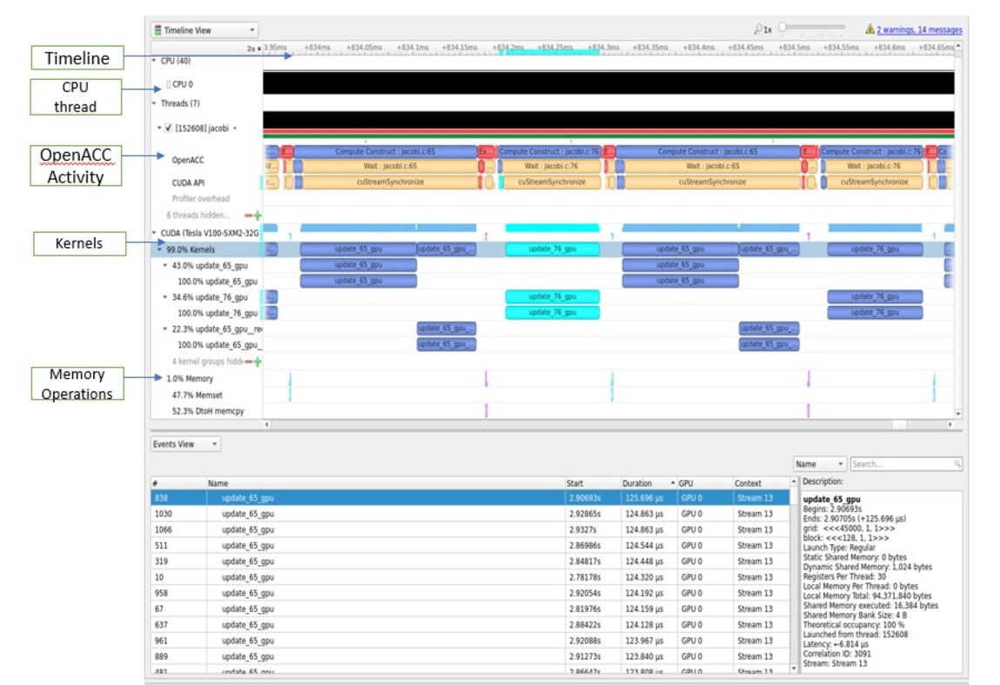
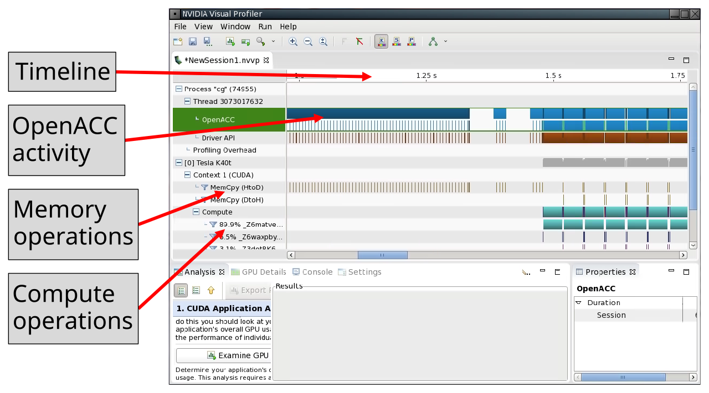
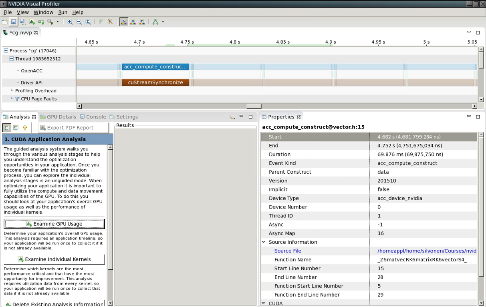
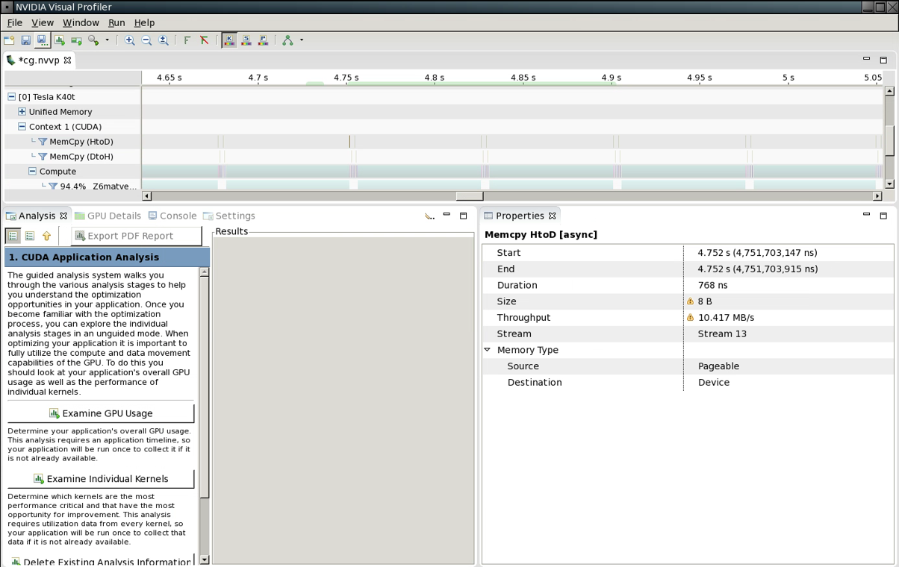
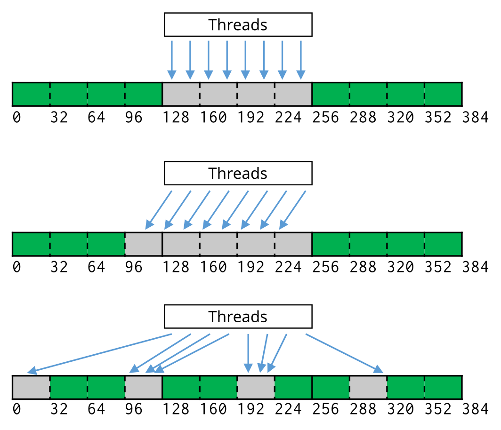

# Outline

- NVidia profiling tools
- Tuning compute region performance
    - Enabling vectorization
    - Loop optimizations
    - Branches
    - Memory access


# Profiling tools {.section}


# NVIDIA NVPROF profiler

- NVIDIA released the Nsight recently for profiling. One of the main reasons for 
  the new tool is scalability and, of course, new features 
    - It is included with CUDA since 10.x
- GPU profiling capabilities
    - High-level usage statistics
    - Timeline collection
    - Analysis metrics


# OpenACC example

```bash
$ nsys profile -t nvtx,openacc --stats=true -s cpu ./jacobi
...
Generating CUDA API Statistics...
CUDA API Statistics (nanoseconds)

Time(%)      Total Time       Calls         Average         Minimum         Maximum  Name                                                                            
-------  --------------  ----------  --------------  --------------  --------------  ---------------------------
   77.1       108005341        1450         74486.4            1815          189044  cuStreamSynchronize                                                             
   16.6        23232332           1      23232332.0        23232332        23232332  cuMemHostAlloc                                                                  
    2.9         4037274        1091          3700.5            2815           24189  cuLaunchKernel                                                                  
    0.8         1182112         361          3274.5            2911           21123  cuMemcpyDtoHAsync_v2                                                            
    0.6          855308         361          2369.3            2065           10502  cuMemsetD32Async                                                                
    0.6          813341           1        813341.0          813341          813341  cuMemAllocHost_v2                                                               

Generating CUDA Kernel Statistics...
CUDA Kernel Statistics (nanoseconds)

Time(%)      Total Time   Instances         Average         Minimum         Maximum  Name                                                                                                                          -------  --------------  ----------  --------------  --------------  --------------  ---------------------------
   43.2        43864453         361        121508.2          118208          124671  update_65_gpu                                                                                                                    34.9        35436443         361         98161.9           94912          102015  update_76_gpu                                                                                                                    21.9        22215422         361         61538.6           60095           62720  update_65_gpu__red                                                                                                                                                                                                                                                                                                                               Generating CUDA Memory Operation Statistics...
CUDA Memory Operation Statistics (nanoseconds)

Time(%)      Total Time  Operations         Average         Minimum         Maximum  Name                                                                            
-------  --------------  ----------  --------------  --------------  --------------  --------------------------------
   52.3          567609         361          1572.3            1535            2945  [CUDA memcpy DtoH]                                                              
   47.7          517209         361          1432.7            1407            1760  [CUDA memset]                                                                   

CUDA Memory Operation Statistics (KiB)

Total      Operations              Average            Minimum              Maximum    Name                                                                            
-------  --------------  -------------------  -----------------  -------------------  -------------------------------
1.410             361                0.004              0.004                0.004    [CUDA memcpy DtoH]                                                              
1.410             361                0.004              0.004                0.004    [CUDA memset]         
...
```

# NVIDIA Nsight workflow

{.center}

Source: NVIDIA

# NVIDIA Systems

{.center}


# NVIDIA Metrics
```
srun -n 1 nv-nsight-cu-cli --devices 0 --query-metrics  > my_metrics.txt

dram__bytes                 # of bytes accessed in DRAM
dram__bytes_read            # of bytes read from DRAM
dram__bytes_write           # of bytes written to DRAM
dram__cycles_active         # of cycles where DRAM was active
...
tpc__cycles_active          # of cycles where TPC was active
tpc__cycles_elapsed         # of cycles where TPC was active
tpc__cycles_in_frame        # of cycles in user-defined frame
tpc__cycles_in_region       # of cycles in user-defined region
...
```

# Nsight Compute (I)
```
srun -n 1  nv-nsight-cu-cli ./jacobi
...
  update_65_gpu, 2020-Oct-18 23:42:06, Context 1, Stream 13
   Section: GPU Speed Of Light
    ---------------------------------------------------------------------- --------------- ------------------------------
    DRAM Frequency                                                           cycle/usecond                         849.78
    SM Frequency                                                             cycle/nsecond                           1.25
    Elapsed Cycles                                                                   cycle                        151,948
    Memory [%]                                                                           %                          60.03
    SOL DRAM                                                                             %                          43.34
    Duration                                                                       usecond                         121.63
    SOL L1/TEX Cache                                                                     %                          61.33
    SOL L2 Cache                                                                         %                          36.73
    SM Active Cycles                                                                 cycle                     148,450.91
    SM [%]                                                                               %                          44.05
    ---------------------------------------------------------------------- --------------- ------------------------------
    WRN   Memory is more heavily utilized than Compute: Look at the Memory Workload Analysis report section to see
          where the memory system bottleneck is. Check memory replay (coalescing) metrics to make sure you're
          efficiently utilizing the bytes transferred. Also consider whether it is possible to do more work per memory
          access (kernel fusion) or whether there are values you can (re)compute.

# Nsight Compute (II)
```
    Section: Launch Statistics
    ---------------------------------------------------------------------- --------------- ------------------------------
    Block Size                                                                                                        128
    Grid Size                                                                                                      45,000
    Registers Per Thread                                                   register/thread                             30
    Shared Memory Configuration Size                                                 Kbyte                          16.38
    Driver Shared Memory Per Block                                              byte/block                              0
    Dynamic Shared Memory Per Block                                            Kbyte/block                           1.02
    Static Shared Memory Per Block                                              byte/block                              0
    Threads                                                                         thread                      5,760,000
    Waves Per SM                                                                                                    35.16
    ---------------------------------------------------------------------- --------------- ------------------------------

    Section: Occupancy
    ---------------------------------------------------------------------- --------------- ------------------------------
    Block Limit SM                                                                   block                             32
    Block Limit Registers                                                            block                             16
    Block Limit Shared Mem                                                           block                             96
    Block Limit Warps                                                                block                             16
    Theoretical Active Warps per SM                                                   warp                             64
    Theoretical Occupancy                                                                %                            100
    Achieved Occupancy                                                                   %                          83.71
    Achieved Active Warps Per SM                                                      warp                          53.58
    ---------------------------------------------------------------------- --------------- ------------------------------
```

# NVIDIA visual profiler

* Nvprof is an older profiling tool

{.center}


# Details on OpenACC compute construct

{.center}


# Details on memory copy

{.center}


# Optimization {.section}


# Compute optimizations

- Data movement is and important part to optimize when using GPUs
    - Keeping data on the GPU as long as possible
- Getting the compiler to generate parallel code
    - Addressing loop dependencies
- Data access and execution divergence are important for GPU performance


# Loop dependencies

<div class="column">
```c
/* FLOW dependency, k>0 */
for (int i=0; i<N; i++)
    A[i] = A[i-k]+1;
/* ANTI dependency, k>0 */
for (int i=0; i<N; i++)
    A[i] = A[i+k]+1;
```
```fortran
! FLOW dependency, k>0
do i=0, N
    a(i) = a(i-k) + 1;
end do
! ANTI dependency, k>0
do i=0, N
    a(i) = a(i+k) + 1;
end do
```
</div>

<div class="column">
- FLOW dependency
    - Read After Write (RAW), data is written to is read on the following
      iteration round(s)
- ANTI dependency
    - Write After Read (WAR), data read is written to on the following
      iteration rounds
</div>


# Loop dependencies

- Dependencies disable vectorization, which is essential for good
  performance
- Rewrite the loops so that the dependency is removed
- Try to split the loop, use temporary array, etc.
- Some dependencies can not be removed
    - Try a different algorithm?


# Loop dependencies and C

- C pointers are hard for the compiler to follow
    - Compiler will not know, if a loop can be vectorized safely, if a
      function has pointer arguments
    - Can be a *false* dependency

```c
void adder(float *x, float *y, float *res) {
    for (int i=0; i < VECSIZE; i++) {
        res[i] = x[i] + y[i];
    }
}
```

- What if `res` and `x` overlap in memory?


# C99 restrict keyword

- C99 standard has restrict keyword which tells the compiler that the
  pointer is accessed so that it does not overlap with other accesses

```c
void adder(float restrict *x, float restrict *y, float restrict *res) {
    for (int i=0; i < VECSIZE; i++) {
        res[i] = x[i] + y[i];
    }
}
```


# Loop independent clause

- OpenACC independent clause tells to the compiler that loop iterations
  are independent
    - Overrides any compiler dependency analysis
    - You have to make sure that the iterations are independent!

```c
#pragma acc loop independent
void adder(float *x, float *y, float *res) {
    for (int i=0; i < VECSIZE; i++) {
        res[i] = x[i] + y[i];
    }
}
```


# Loop directive

- Loop directive accepts several fine-tuning clauses
    - **gang** -- apply gang-level parallelism
    - **worker** -- apply worker-level parallelism
    - **vector** -- apply vector-level parallelism
    - **seq** -- run sequentially
- Multiple levels can be applied to a loop nest, but they have to be
  applied in top-down order


# Optimize loops: vector length

- Tell the compiler that when using NVIDIA device it should use a
  vector length of 32 on the innermost loop
- Because these parameters depend on the accelerator type, it is a good
  practice to add **device_type** clause

```c
for (int i=0; i<imax; i++) {
    ...
    #pragma acc loop device_type(nvidia) vector(32)
    for (int j=0; j<jmax; j++) {
        ... /* No further loops in this block */
    }
}
```


# Optimize loops: specifying workers


```c
#pragma acc loop device_type(nvidia) gang worker(32)
for (int i=0; i<imax; i++) {
    ...
    #pragma acc loop device_type(nvidia) vector(32)
    for (int j=0; j<jmax; j++) {
        ...
    }
}
```

- Tell the compiler that when using NVIDIA device, the outer loop
  should be broken over gangs and workers with 32 workers per gang


# Additional loop optimizations

- `collapse(N)`
    - Same as in OpenMP, take the next N tightly nested loops and flatten
      them into a one loop
    - Can be beneficial when loops are small
    - Breaks the next loops into tiles (blocks) before parallelizing the
      loops
    - For certain memory access patterns this can improve data locality


# What values should I try?

- Depends on the accelerator you are using
- You can try out different combinations, but deterministic optimizations
  require good knowledge on the accelerator hardware
    - In the case of NVIDIA GPUs you should start with the NVVP results
      and refer to CUDA documentation
    - One hard-coded value: for NVIDIA GPUs the vector length should
      always be 32, which is the (current) warp size


# Branches in device code

- 32 threads running the same instruction at the same time
- Avoid branches based on thread id unless evenly dividable by 32
    - If (i%2) NO!
    - if (i%32) ok
- When unavoidable keep branches short


# Coalesced memory access

<div class="column">
- Coalesced memory access
    - 32 threads accessing memory at the same time
    - 32 Byte access granularity
- Overly simplified
    - Some cases 128 bytes access granularity
    - 128 byte coalesced accesses can improve performance
</div>

<div class="column">

</div>


# Summary

- Profiling is essential for optimization
    - NVPROF and NVVP for NVIDIA platform
- Loop optimizations
- Branches
- Memory access patterns
