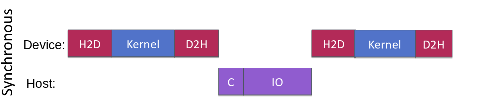
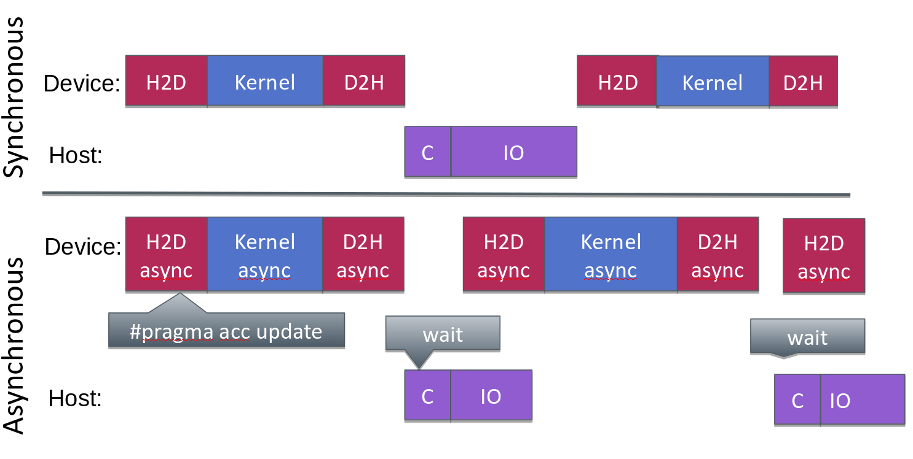
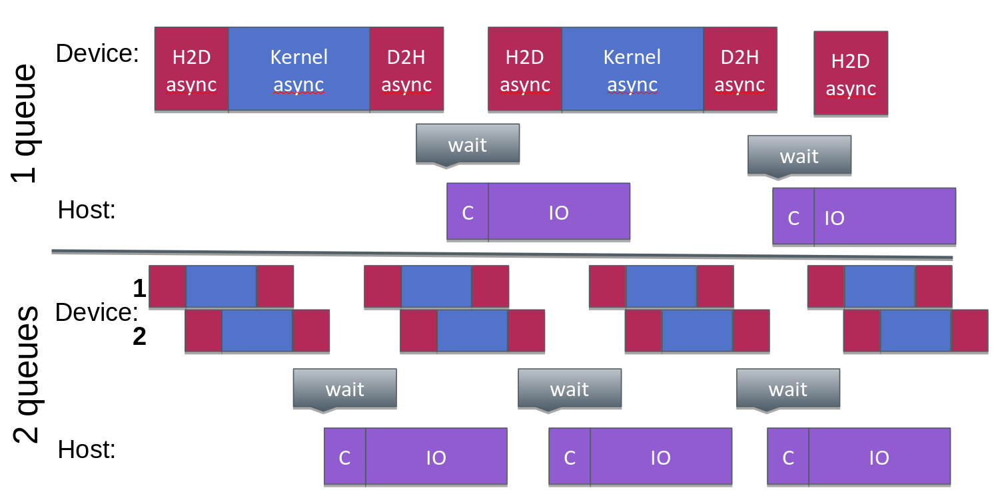

# Motivation

- By default, the local thread will wait until OpenACC compute or data
  construct has completed its execution
- Potential parallelism in overlapping compute, data transfers, MPI,
  etc.

{.center}


# Asynchronous execution: async and wait

- `async[(int-expr)]` **clause** enables one to enqueue compute and
  data operations, and local (host) thread will continue execution
    - Order is preserved for enqueued operations
    - OpenACC `async` clause is supported by constructs:
     `parallel`, `kernels`,
     `enter data`, `exit data`,
     `update`, `wait`

- `wait[(int-expr-list)]` **directive** causes the CPU thread to wait for
  completion of asynchronous operations
    - C/C++: `#pragma acc wait [(int-expr-list)] [clauses]`
    - Fortran: `!$acc wait [(int-expr-list)] [clauses]`


# OpenACC and asynchronous execution

{.center}


# Multiple queues

- One can have multiple queues, enabling one to overlap execution of
  kernels and data operations
- `async` clause
    - non-negative integer argument, defining on which queue the operation
      is placed
    - Within one queue order is preserved, in different queues operations
      have no coupling
    - If no queue is given the default queue is used
- `wait` directive
    - list of integers as argument, defining which queues to wait on.
    - By default it waits for all.


# OpenACC and asynchronous execution

{.center}


# Example c = a + b (1/2)
```c
//Initialization of a,b,c

a = malloc(sizeof(double) * N);
b = malloc(sizeof(double) * N);
c = malloc(sizeof(double) * N);

for (int i = 0; i < N;i++) {
    a[i] = i;
    b[i] = i;
}
```
# Example c = a + b (2/2)

```c
#pragma acc data create(a[:N], b[:N], c[:N])
{
    t1 = omp_get_wtime();
    for(q = 0; q < queues; q++) {
        qLength = N / queues;
        qStart = q * qLength;
        #pragma acc update device(a[qStart:qLength], b[qStart:qLength]) async(q)
        #pragma acc parallel loop async(q)
        for (int i = qStart; i < qStart + qLength; i++) {
            c[i] = a[i] + b[i];
        }
        #pragma acc update self(c[qStart:qLength]) async(q)
    } //end for (q)
    #pragma acc wait
    t2 = omp_get_wtime();
} //end acc data

printf("compute in %g sn", t2 - t1);
```


# Summary

- Asynchronous execution
    - Enables better performance by overlapping different operations
