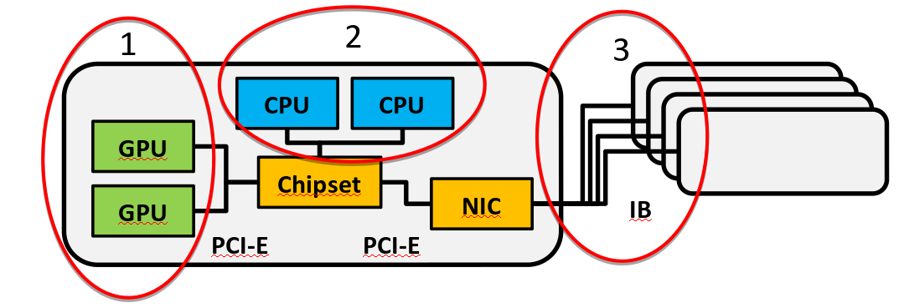

# Multi-GPU programming with OpenACC

<div class=column>
Three levels of hardware parallelism in a supercomputer

1. GPU - different levels of threads
2. Node - GPU, CPU and interconnect
3. Machine - several nodes connected with interconnect
</div>
<div class=column>
Three parallelization methods

1. OpenACC
2. OpenMP or MPI
3. MPI between nodes
</div>

{.center}


# Multi-GPU communication cases

- Single node multi-GPU programming
    - All GPUs of a node are accessible from single process and its OpenMP
      threads
    - Data copies either directly or through CPU memory
- Multi node multi-GPU programming
    - Communication between nodes requires message passing, MPI
- In this lecture we will in detail only discuss parallelization with MPI
    - This enables direct scalability from single to multi-node


# Selecting device

- OpenACC permits using multiple GPUs within one node by using the
  `acc_get_num_devices` and `acc_set_device_num` functions
- Asynchronous OpenACC calls, OpenMP threads or MPI processes must be used
  in order to actually run kernels in parallel
- Issue when using MPI:
    - If a node has more than one GPU, all processes in the node can
      access all GPUs of the node
    - MPI processes do not have a priori information on the other ranks in
      the same node
    - Which GPU the MPI process should select?


# Selecting the device in MPI

- Model is to use **one** MPI task per GPU
- Launching job
    - Launch you application so that there are as many MPI tasks per node as
      there are GPUs
    - Make sure the affinity is correct - processes equally split between the
      two sockets (that nodes typically have)
    - Read the user guide of the system for details how to do this!
- In the code a portable and robust solution is to use MPI3 shared memory
    communicators to split the GPUs between processes
- Note that you can also use OpenMP to utilize all cores in the node for
  computations on CPU side


# Selecting the device in MPI

```c
MPI_Comm shared;
int local_rank, local_size, num_gpus;

MPI_Comm_split_type(MPI_COMM_WORLD, MPI_COMM_TYPE_SHARED, 0,
                    MPI_INFO_NULL, &shared);
MPI_Comm_size(shared, &local_size); // number of ranks in this node
MPI_Comm_rank(shared, &local_rank); // my local rank
num_gpus = acc_get_num_device(acc_device_nvidia); // num of gpus in node
if (num_gpus == local_size) {
    acc_set_device_num(local_rank);
} // otherwise error
```


# Data transfers

- Idea: use MPI to transfer data between GPUs, use OpenACC-kernels for
  computations
- Additional complexity: GPU memory is separate from that of a CPU
- GPU-aware MPI-library
    - Can use the device pointer in MPI calls - no need for additional buffers
    - No need for extra buffers and device-host-device copies
    - If enabled on system data will be transferred via transparent RDMA
- Without GPU-aware MPI-library
    - Data must be transferred from the device memory to the host memory and
      vice versa before performing MPI-calls


# Using device addresses with host_data

- For accessing device addresses of data on the host OpenACC includes
  `host_data` construct with the `use_device` clause
- No additional data transfers needed between the host and the device,
  data automatically accessed from the device memory via **R**emote
  **D**irect **M**emory **A**ccess
- Requires *library* and *device* support to function!


# MPI communication with GPU-aware MPI

- MPI send
    - Send the data from the buffer on the **device** with MPI
- MPI receive
    - Receive the data to a buffer on the **device** with MPI
- No additional buffers or data transfers needed to perform
  communication


# MPI communication with GPU-aware MPI

```c
/* MPI_Send with GPU-aware MPI */
#pragma acc host_data use_device(data)
{
    MPI_Send(data, N, MPI_DOUBLE, to, MPI_ANY_TAG, MPI_COMM_WORLD);
}

/* MPI_Recv with GPU-aware MPI */
#pragma acc host_data use_device(data)
{
    MPI_Recv(data, N, MPI_DOUBLE, from, MPI_ANY_TAG, MPI_COMM_WORLD,
             MPI_STATUS_IGNORE);
}
```


# Summary

- Typical HPC cluster node has several GPUs in each node
    - Selecting the GPUs with correct affinity
    - Data transfers using MPI
