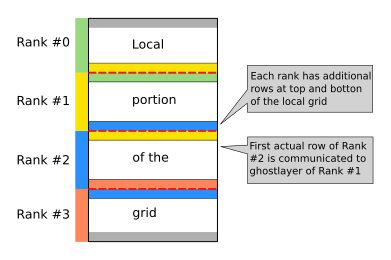

## Heat equation solver with MPI + OpenACC

Study the MPI-parallelized version of the heat equation and convert it into
an OpenACC accelerated version.

A schematic representation of the row-wise domain decomposition using ghost
layers looks like this:

