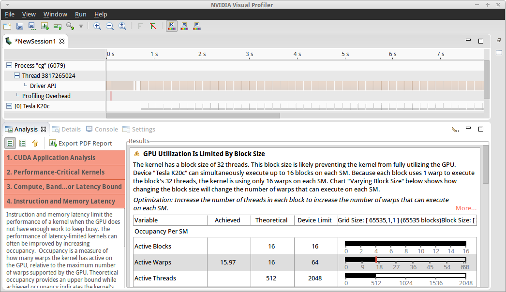
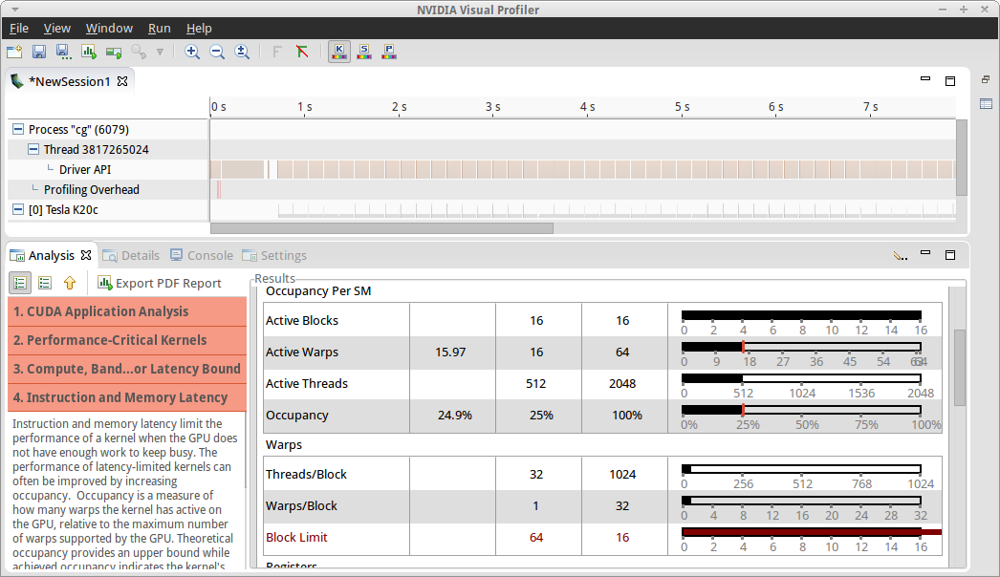

NVIDIA OpenACC Course - Lab 3

=============================

In this lab you will build upon the work on a Conjugate Gradient
solver from [lab
2](https://github.com/NVIDIA-OpenACC-Course/nvidia-openacc-course-sources/tree/master/october-2015/labs/lab2)
to add explicit data management directives, eliminating the need to
use CUDA Unified Memory, and optimize the `matvec` kernel using the
OpenACC `loop` directive.

Step 2 - Optimize Loops - Vector Length
---------------------------------------

Now that we're running on the GPU and getting correct answers , let's apply our
knowledge of the code to help the compiler make better decisions about how to
parallelize our loops. We know from the `allocate_3d_poisson_matrix` routine
that the most non-zero elements we'll have per row is 27. By examining the
compiler output, as shown below, we know that the compiler chose a vector
length of 128 for the `matvec` loops. This means that with the
compiler-selected vector length of 128, 101 vector lanes (threads) will go
unused. Let's tell the compiler to choose a better vector length for these
loops.

    matvec(const matrix &, const vector &, const vector &):
          8, include "matrix_functions.h"
              15, Generating present(row_offsets[:],cols[:],Acoefs[:],xcoefs[:],ycoefs[:])
              16, Loop is parallelizable
                  Accelerator kernel generated
                  Generating Tesla code
                  16, #pragma acc loop gang, vector(128) /* blockIdx.x threadIdx.x */
              20, Loop is parallelizable

On an NVIDIA GPU the vector length must be a multiple of the *warp size* of the
GPU, which on all NVIDIA GPUs to-date is 32. This means that the closest vector
length we can choose is 32. Depending on whether the code uses `kernels` or
`parallel loop`, we can specify the vector length one of two ways.

### Kernels
When using the `kernels` directive, the vector length is given by adding
`vector(32)` to the loop we want to use as the `vector` loop. So for our
`matvec` loops, we'd apply the vector length as shown below.

#### C/C++
    #pragma acc kernels present(row_offsets,cols,Acoefs,xcoefs,ycoefs)
      {
        for(int i=0;i<num_rows;i++) {
          double sum=0;
          int row_start=row_offsets[i];
          int row_end=row_offsets[i+1];
          #pragma acc loop device_type(nvidia) vector(32)
          for(int j=row_start;j<row_end;j++) {
            unsigned int Acol=cols[j];
            double Acoef=Acoefs[j];
            double xcoef=xcoefs[Acol];
            sum+=Acoef*xcoef;
          }
          ycoefs[i]=sum;
        }
      }

#### Fortran
    !$acc kernels present(arow_offsets,acols,acoefs,x,y)
    do i=1,a%num_rows
      tmpsum = 0.0d0
      row_start = arow_offsets(i)
      row_end   = arow_offsets(i+1)-1
      !$acc loop device_type(nvidia) vector(32)
      do j=row_start,row_end
        acol = acols(j)
        acoef = acoefs(j)
        xcoef = x(acol)
        tmpsum = tmpsum + acoef*xcoef
      enddo
      y(i) = tmpsum
    enddo
    !$acc end kernels

### Parallel Loop
When using `parallel loop` the vector length is given at the top of the region,
as shown below.

#### C/C++
    #pragma acc parallel loop present(row_offsets,cols,Acoefs,xcoefs,ycoefs) \
            device_type(nvidia) vector_length(32)
      for(int i=0;i<num_rows;i++) {
        double sum=0;
        int row_start=row_offsets[i];
        int row_end=row_offsets[i+1];
    #pragma acc loop reduction(+:sum) device_type(nvidia) vector
        for(int j=row_start;j<row_end;j++) {
          unsigned int Acol=cols[j];
          double Acoef=Acoefs[j];
          double xcoef=xcoefs[Acol];
          sum+=Acoef*xcoef;
        }
        ycoefs[i]=sum;
      }

#### Fortran
    !$acc parallel loop private(tmpsum,row_start,row_end) &
    !$acc& present(arow_offsets,acols,acoefs,x,y)         &
    !$acc& device_type(nvidia) vector_length(32)
    do i=1,a%num_rows
      tmpsum = 0.0d0
      row_start = arow_offsets(i)
      row_end   = arow_offsets(i+1)-1
      !$acc loop reduction(+:tmpsum) device_type(nvidia) vector
      do j=row_start,row_end
        acol = acols(j)
        acoef = acoefs(j)
        xcoef = x(acol)
        tmpsum = tmpsum + acoef*xcoef
      enddo
      y(i) = tmpsum
    enddo

---

Notice that the above code adds the `device_type(nvidia)` clause to the
affected loops. Because we only want this optimization to be applied to NVIDIA
GPUs, we've protected that optimization with a `device_type` clause and allowed
the compiler to determine the best value on other platforms. Now that we've
adjusted the vector length to fit the problem, let's profile the code again to
see how well it's performing. Using Visual Profiler, let's see if we can find a
way to further improve performance.

The folders `intermediate.kernels` and `intermediate.parallel` contain the
correct code for the end of this step. If you have any trouble, use the code in
one of these folders to help yourself along.

Step 3 - Optimize Loops - Profile The Application
-------------------------------------------------

Just as in the last lab, we'll use the NVIDIA Visual Profiler to profile our
application.

- If you are doing this lab on your own machine, either launch Visual Profiler
  from its application link or via the `nvvp` command.

Once Visual Profiler has started, create a new session by selecting *File ->
New Session*. Then select the executable that you built by pressing the
*Browse* button next to *File*, browse to your working directory, select the
`cg` executable, and then press *Next*. On the next screen press *Finish*.
Visual Profiler will run for several seconds to collect a GPU timeline and
begin its *guided analysis*.

In the lower left, press the "Examine GPU Usage" button. You may need to
enlarge the bottom panel of the screen by grabbing just below the horizontal
scroll bar at the middle of the window and dragging it up until the button is
visial. After this runs, click on "Examine Individual Kernels" and select the
top kernel in the table. After selecting the top kernel, press the "Perform
Kernel Analysis" button to gather further performance information about this
kernel and wait while Visual Profiler collects additional data ***(this make
take
several minutes)***. When this completes, press "Perform Latency Analysis". The 
screenshot below shows Visual Profiler at this step.

Visual Profiler is telling us that the performance of the matvec kernel is
limited by the amount of parallelism in each gang (referred to as *"block
size"* in CUDA).  Scrolling down in the *Results* section I see that the
*Occupancy* is 25%. Occupancy is a measure of how much parallelism is running
on the GPU versus how much theoretically could be running. 25% occupancy
indicates that resources are sitting idle due to the size of the blocks
(OpenACC gangs).

(***Note:*** *100% occupancy is not necessary for high performance, but
occupancy below 50% is frequently an indicator that optimization is possible)

Scrolling further down in the *Results* section we reach the *Block Limit*
metric, which will be highlighted in red. This is shown in the screenshot
below.

 
This table is showing us that the GPU *streaming multiprocessor (SM)* can
theoretically run 64 *warps* (groups of 32 threads), but only has 16 to run.
Looking at the *Warps/Block* and *Threads/Block* rows of the table, we see that
each block contains 1 warp, or 32 threads, although it could run many more.
This is because we've told the compiler to use a vector length of 32. As a
reminder, in OpenACC many *gangs* run independently of each other, each gang
has 1 or more *workers*, each of which operates on a *vector*. With a vector
length of 32, we'll need to add workers in order to increase the work per gang.
Now we need to inform the compiler to give each gang more work by using
*worker* parallelism.

Step 4 - Optimize Loops - Increase Parallelism
----------------------------------------------

To increase the parallelism in each OpenACC gang, we'll use the worker level of
parallelism to operate on multiple vectors within each gang. On an NVIDIA GPU
the *vector length X number of workers* must be a multiple of 32 and no larger
than 1024, so let's experiment with increasing the number of workers. From just
1 worker up to 32. We want the outermost loop to be divided among gangs and
workers, so we'll specify that it is an gang *and* worker loop. By only
specifying the number of workers, we allow the compiler to generate enough
gangs to use up the rest of the loop iterations applying worker parallelism. 

### Kernels
When using the `kernels` directive, use the `loop` directive to specify that
the outer loop should be a *gang* and *worker* loop with 32 workers as shown
below. Experiment with the number of workers to find the best value.

#### C/C++
    #pragma acc kernels present(row_offsets,cols,Acoefs,xcoefs,ycoefs)
      {
    #pragma acc loop device_type(nvidia) gang worker(32)
        for(int i=0;i<num_rows;i++) {
          double sum=0;
          int row_start=row_offsets[i];
          int row_end=row_offsets[i+1];
          #pragma acc loop device_type(nvidia) vector(32)
          for(int j=row_start;j<row_end;j++) {
            unsigned int Acol=cols[j];
            double Acoef=Acoefs[j];
            double xcoef=xcoefs[Acol];
            sum+=Acoef*xcoef;
          }
          ycoefs[i]=sum;
        }
      }

#### Fortran
    !$acc kernels present(arow_offsets,acols,acoefs,x,y)
    !$acc loop device_type(nvidia) gang worker(32)
    do i=1,a%num_rows
      tmpsum = 0.0d0
      row_start = arow_offsets(i)
      row_end   = arow_offsets(i+1)-1
      !$acc loop device_type(nvidia) vector(32)
      do j=row_start,row_end
        acol = acols(j)
        acoef = acoefs(j)
        xcoef = x(acol)
        tmpsum = tmpsum + acoef*xcoef
      enddo
      y(i) = tmpsum
    enddo
    !$acc end kernels

### Parallel Loop
When using the `parallel loop` directive, use `gang` and `worker` to specify
that the outer loop should be a *gang* and *worker* loop and then add
`num_workers(32)` to specify 32 workers, as shown below. Experiment with 
the number of workers to find the best value.

#### C/C++
    #pragma acc parallel loop present(row_offsets,cols,Acoefs,xcoefs,ycoefs) \
            device_type(nvidia) gang worker vector_length(32) num_workers(32)
      for(int i=0;i<num_rows;i++) {
        double sum=0;
        int row_start=row_offsets[i];
        int row_end=row_offsets[i+1];
    #pragma acc loop reduction(+:sum) device_type(nvidia) vector
        for(int j=row_start;j<row_end;j++) {
          unsigned int Acol=cols[j];
          double Acoef=Acoefs[j];
          double xcoef=xcoefs[Acol];
          sum+=Acoef*xcoef;
        }
        ycoefs[i]=sum;
      }

#### Fortran
    !$acc parallel loop private(tmpsum,row_start,row_end) &
    !$acc& present(arow_offsets,acols,acoefs,x,y)         &
    !$acc& device_type(nvidia) gang worker num_workers(32) vector_length(32)
    do i=1,a%num_rows
      tmpsum = 0.0d0
      row_start = arow_offsets(i)
      row_end   = arow_offsets(i+1)-1
      !$acc loop reduction(+:tmpsum) device_type(nvidia) vector
      do j=row_start,row_end
        acol = acols(j)
        acoef = acoefs(j)
        xcoef = x(acol)
        tmpsum = tmpsum + acoef*xcoef
      enddo
      y(i) = tmpsum
    enddo

---

After experimenting with the number of workers, performance should be 
similar to the table below.

| Workers |  K40    |  Qwiklab  |
|---------|----------|-----------|
|    1    |          | 23.818328 |
|    2    | 61.03544 | 13.19415  |
|    4    | 31.36616 | 8.834735  |
|    8    | 16.71916 | 9.030089  |
|   16    | 8.81069  | 9.464214  |
|   32    | 6.488389 | 10.400797 |

Conclusion
----------

In this lab we started with a code that relied on CUDA Unified Memory to handle
data movement and added explicit OpenACC data locality directives. This makes
the code portable to any OpenACC compiler and accelerators that may not have
Unified Memory. We used both the unstructured data directives and the `update`
directive to achieve this.

Next we profiled the code to determine how it could run more efficiently on the
GPU we're using. We used our knowledge of both the application and the hardware
to find a loop mapping that ran well on the GPU, achieving a 2-4X speed-up over
our starting code.

The table below shows runtime for each step of this lab on an NVIDIA Tesla K40 
and on the Qwiklabs GPUs.

| Step             | K40       | Qwiklab GPU | 
| ---------------- | --------- | ----------- |
| Unified Memory   | 8.458172  | 32.084347   |
| Explicit Memory  | 8.459754  | 33.251878   | 
| Vector Length 32 | 11.656281 | 23.83046    |
| Final Code       | 4.802727  | 8.834735    | 
